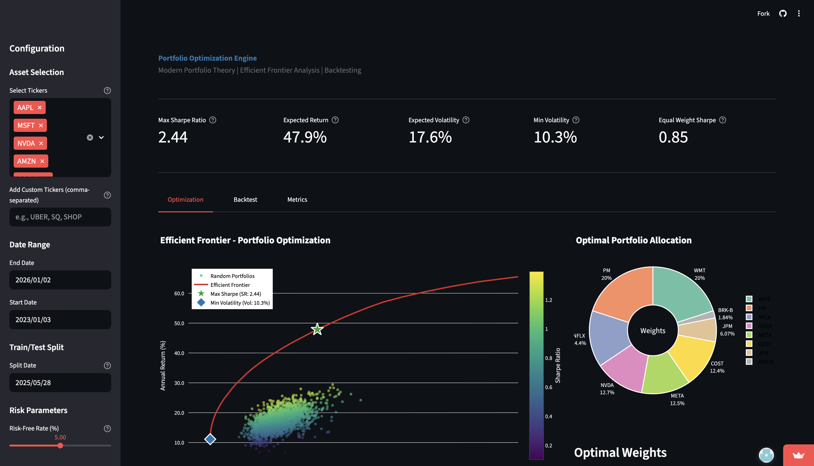
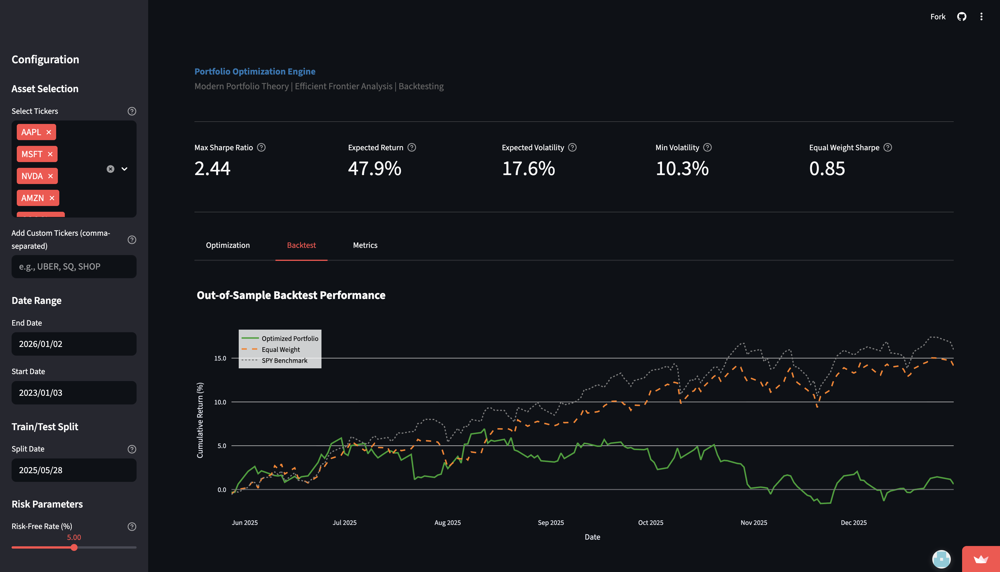

# Institutional Portfolio Optimization Engine

[](https://institutional-portfolio-optimizer.streamlit.app/)
[](https://www.python.org/downloads/)
[](https://opensource.org/licenses/MIT)
[](https://github.com/psf/black)

> **Live Dashboard:** [institutional-portfolio-optimizer.streamlit.app](https://institutional-portfolio-optimizer.streamlit.app/)

An institutional-grade portfolio optimization dashboard built on **Modern Portfolio Theory (MPT)**. This application provides interactive tools for constructing optimal investment portfolios, visualizing the efficient frontier, and performing out-of-sample backtesting against the S&P 500 benchmark.

Designed to bridge the gap between theoretical finance and practical asset management by incorporating real-world constraints like diversification limits.

---

## Dashboard Preview


*Figure 1: Efficient Frontier Analysis & Asset Allocation with Diversification Constraints*

---

## Key Features

* **Institutional Universe:** Automatically pulls data for the Top 50 S&P 500 constituents via `yfinance`.
* **Diversification Controls:** User-defined **Maximum Weight Constraints** (e.g., max 5% per asset) to prevent corner solutions and reduce concentration risk.
* **Efficient Frontier Visualization:** Interactive Monte Carlo simulation (2,000+ portfolios) identifying the optimal risk/return trade-offs.
* **Robust Backtesting:** Out-of-sample performance testing comparing the "Max Sharpe" and "Min Volatility" portfolios against the **SPY ETF** benchmark.
* **Advanced Risk Metrics:** Real-time calculation of Sharpe Ratio, Sortino Ratio, Value at Risk (VaR), and Maximum Drawdown.

---

## Performance Analysis

The engine separates data into **In-Sample (Training)** for optimization and **Out-of-Sample (Testing)** for validation.


*Figure 2: Out-of-Sample Backtesting vs. S&P 500 Benchmark*

---

## Mathematical Framework

The core optimization engine uses `scipy.optimize` to solve for the Efficient Frontier based on Harry Markowitz's Modern Portfolio Theory (1952).

### 1. Objective Functions

**Maximize Sharpe Ratio:**
$$\text{maximize } \frac{E[R_p] - R_f}{\sigma_p}$$

**Minimize Volatility:**
$$\text{minimize } \sigma_p = \sqrt{w^T \Sigma w}$$

### 2. Constraints

To ensure realistic portfolio construction, the solver adheres to:

1.  **Budget Constraint:** $\sum w_i = 1$ (Fully Invested)
2.  **Long-Only Constraint:** $w_i \ge 0$ (No Short Selling)
3.  **Diversification Constraint:** $w_i \le w_{max}$ (User defined, e.g., 0.10)

Where:
* $w$ = Weight vector
* $\Sigma$ = Covariance matrix (annualized)
* $R_f$ = Risk-free rate

---

## Tech Stack & Architecture

This project is built using a modular OOP architecture to ensure scalability and maintainability.

| Component | Library | Purpose |
| :--- | :--- | :--- |
| **Frontend** | `Streamlit` | Interactive Web Dashboard |
| **Visualization** | `Plotly` | Interactive Financial Charts |
| **Optimization** | `Scipy` | SLSQP Solver for Non-Linear Problems |
| **Data Processing** | `Pandas` / `NumPy` | Vectorized Return Calculations |
| **Data Feed** | `yfinance` | Real-time Market Data API |

### Project Structure
```bash
portfolio-optimizer/
├── config.py               # Central configuration (tickers, constraints)
├── src/
│   ├── data_loader.py      # ETL Pipeline for Market Data
│   ├── mathematics.py      # Numba-optimized Financial Metrics
│   ├── optimizer.py        # Scipy Solver Logic
│   └── visualizer.py       # Plotly Charting Engine
├── tests/                  # Pytest Unit Tests
└── app.py                  # Main Application Entry Point